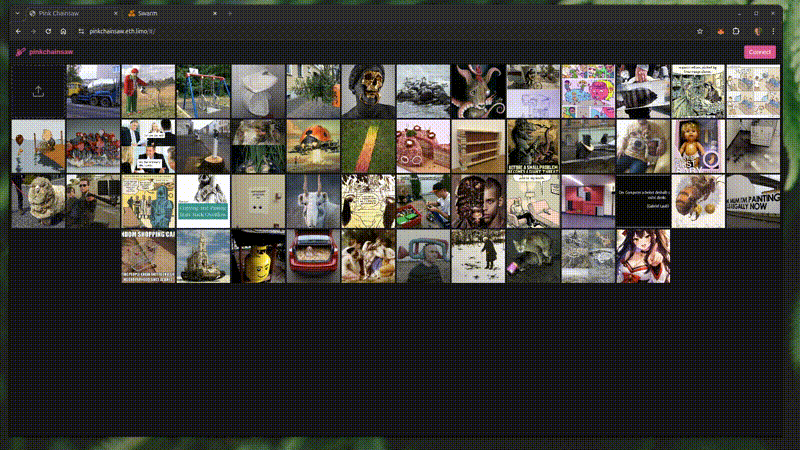

# Pink Chainsaw



A decentralized imageboard on Gnosis Chain with Ethereum Swarm storage.

Users post images, comment, and vote using xBZZ tokens. Fees from posts and comments automatically top up the poster's Swarm postage stamp, keeping content alive on the network. A social score system rewards good content with lower fees and penalizes bad content with higher fees. Anyone can browse all content via a public Swarm gateway without a wallet.

## Architecture

- **Smart Contract**: Solidity 0.8.20, built with Foundry
- **Frontend**: React 19 + TypeScript + Vite SPA (hash router for Swarm hosting)
- **Chain**: Gnosis Chain (xDAI for gas, xBZZ for fees)
- **Storage**: Ethereum Swarm (images + comment text)
- **ENS**: [pinkchainsaw.eth](https://pinkchainsaw.eth.limo)
- **Wallet**: `0x798EF0F261BD5C18FA9Ddaa197341074bDedaAD4`

## How Fees Work

| Action | Fee destination |
|---|---|
| Create thread | Tops up poster's postage stamp |
| Create comment | Tops up commenter's postage stamp |
| Upvote / Downvote | Sent to post owner |

Fees are calculated based on social score: higher score = lower fees (1x-5x multiplier).

By routing post/comment fees into the Swarm PostageStamp contract, content stays alive on the network as long as users keep interacting.

## Read vs Write

| Action | Requires wallet | Requires Bee node |
|---|---|---|
| Browse images | No (gateway) | No |
| Read comments | No (gateway) | No |
| Upload images | Yes + xBZZ | Yes + postage stamp |
| Post comments | Yes + xBZZ | Yes + postage stamp |
| Vote | Yes + xBZZ | No |

If a local Bee node is connected, reads go through it (faster). Otherwise the public gateway (`api.gateway.ethswarm.org`) is used.

## Features

- Browse images and comments without a wallet (read-only via gateway)
- Connect modal with wallet connect/disconnect, Bee URL config, and stamp selection
- Upload tile with drag-and-drop in the main grid
- Auto chain-switch prompt to Gnosis Chain
- Create image threads (uploaded to Swarm, referenced on-chain)
- Nested comments with threaded replies
- Upvote / downvote with xBZZ token fees
- Social score system (higher score = lower fees)
- Automatic postage stamp top-up from fees
- ENS name resolution for addresses
- Live updates via contract event watching (no page reload needed)
- Dark UI with dense tile grid and pink accent

## Contracts

| Contract | Address |
|---|---|
| Pinkchainsaw | `0xFe73D7bBA8A6228Aa3Aa4f955A1031eb0E83f90e` |
| BZZ Token (xBZZ) | `0xdBF3Ea6F5beE45c02255B2c26a16F300502F68da` |
| PostageStamp (Swarm) | `0x45a1502382541Cd610CC9068e88727426b696293` |

## Prerequisites

- [Foundry](https://getfoundry.sh/) (`curl -L https://foundry.paradigm.xyz | bash && foundryup`)
- Node.js 20+
- [Swarm Desktop](https://www.ethswarm.org/build/desktop) (for uploading images/comments)
- MetaMask or injected wallet

## Quick Start

```bash
# Install all dependencies
make install

# Run tests against Gnosis Chain fork
make test-fork
```

### Local Development

```bash
# Terminal 1: start Anvil fork of Gnosis Chain
make anvil

# Terminal 2: fund wallets + deploy contract
make anvil-init

# Terminal 3: start frontend dev server
make dev
```

## Deploy

### Contract

```bash
make deploy-contract        # Deploy to Gnosis Chain (uses .env MNEMONIC)
make verify-contract CONTRACT=0x...  # Verify on Blockscout
```

### Frontend

```bash
make deploy-frontend        # Build + upload to Swarm + update ENS
```

This builds the frontend, uploads to Swarm, and automatically updates the ENS content hash on mainnet.

Live at:
- https://pinkchainsaw.eth.limo
- https://pinkchainsaw.eth.bzz.link

### ENS Only

```bash
make update-ens SWARM_HASH=<hash>  # Update ENS content hash manually
```

### Full Deploy

```bash
make deploy-all             # Contract + frontend
```

## All Make Commands

```
make help                   # Show all commands

# Setup
make install                # Install contracts + frontend deps

# Development
make anvil                  # Start local Anvil fork of Gnosis Chain
make anvil-init             # Fund wallets + deploy contract to local Anvil
make dev                    # Start frontend dev server

# Testing
make test                   # Run unit tests
make test-fork              # Run all tests against Gnosis Chain fork
make test-unit              # Run only unit tests (no fork)
make test-gas               # Run tests with gas report
make coverage               # Run test coverage

# Build
make build                  # Build contracts
make build-frontend         # Build frontend for production
make build-all              # Build contracts + frontend
make abi                    # Extract ABI to frontend
make typecheck              # Type-check frontend

# Deploy
make deploy-contract        # Deploy contract to Gnosis Chain
make deploy-contract-local  # Deploy contract to local Anvil
make deploy-frontend        # Build + upload to Swarm + update ENS
make update-ens             # Update ENS content hash (SWARM_HASH=...)
make deploy-all             # Contract + frontend to production
make verify-contract        # Verify on Blockscout (CONTRACT=0x...)

# Utilities
make clean                  # Remove build artifacts
make fmt                    # Format Solidity code
make snapshot               # Create gas snapshot
```

## Project Structure

```
pinkchainsaw/
├── src/
│   └── Pinkchainsaw.sol              # Main contract (threads, comments, votes, stamp top-up)
├── test/
│   └── Pinkchainsaw.t.sol            # Fork tests against Gnosis Chain (20 tests)
├── frontend/
│   ├── src/
│   │   ├── components/               # Nav, ThreadList, ThreadTile, UploadTile,
│   │   │                             # ThreadDetails, CommentItem, EnsName, Modal, ChainGuard
│   │   ├── hooks/                    # useBee, BeeContext
│   │   ├── config/                   # wagmi, contract addresses + ABIs
│   │   └── abi/                      # Contract ABI (from forge build)
│   └── index.html
├── anvil-init.sh                     # Fund wallets + deploy to local fork
├── Makefile                          # Dev, test, build, deploy commands
└── foundry.toml                      # Foundry config
```

## Tech Stack

| Layer | Technology |
|---|---|
| Smart Contracts | Solidity 0.8.20, Foundry |
| Frontend | React 19, TypeScript, Vite, Tailwind CSS 4 |
| Web3 | wagmi v2, viem |
| Swarm SDK | @ethersphere/bee-js v11 |
| Routing | React Router 7 (hash router) |
| Chain | Gnosis Chain (ID: 100) |
| Storage | Ethereum Swarm |
| Hosting | Swarm + ENS |
