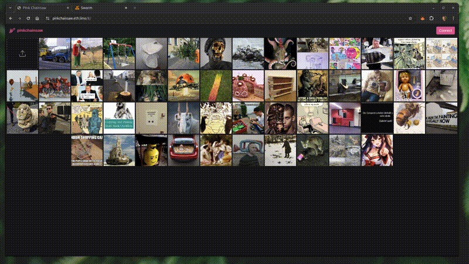

# Pink Chainsaw



A decentralized imageboard on Gnosis Chain with Ethereum Swarm storage.

Users post images, comment, and vote using xBZZ tokens. Every fee tops up the Swarm postage batch of the content being replied to or voted on, so engagement is what keeps a post alive — and a post outlives its author for as long as people keep interacting with it. A reputation system rewards well received content with lower posting fees and penalizes badly received content with higher ones. Anyone can browse all content via a public Swarm gateway without a wallet.

## Architecture

- **Smart Contract**: Solidity 0.8.28 (UUPS upgradeable), built with Foundry
- **Frontend**: React 19 + TypeScript + Vite SPA (hash router for Swarm hosting)
- **Chain**: Gnosis Chain (xDAI for gas, xBZZ for fees)
- **Storage**: Ethereum Swarm (images + comment text)
- **ENS**: [pinkchainsaw.eth](https://pinkchainsaw.eth.limo)
- **Wallet**: `0x798EF0F261BD5C18FA9Ddaa197341074bDedaAD4`

## How Fees Work

Fees are paid in xBZZ. With one exception — the signup fee below — they all land in a Swarm postage
batch rather than anyone's wallet, and the rule is that **engagement funds the storage of the content
being engaged with**, so a post outlives its author for as long as people keep interacting with it.

| Action | Fee | Tops up |
|---|---|---|
| Create thread | scaled by reputation | the Pink Chainsaw batch, which hosts the frontend |
| Comment or reply | scaled by reputation | the batch of the post being replied to |
| Reply to yourself | scaled by reputation | the Pink Chainsaw batch |
| Upvote / downvote | flat, same for everyone | the batch of the post being voted on |

A share of every fee (10% by default, capped at 20%) goes to the Pink Chainsaw batch, so the
frontend keeps paying for its own hosting.

### The signup fee

Postage credit keeps content alive but cannot pay a bill. Renewing the ENS name costs ETH on
mainnet, so the project needs some income it can actually spend. An author's **first post** pays a
one-off signup fee in xBZZ to the Pink Chainsaw wallet — the only fee in the system that goes to a
wallet rather than into storage.

It is charged once per address, never on votes, and skipped entirely until the owner has set a
wallet and an amount. The amount is capped at `MAX_SIGNUP_FEE_MULTIPLE` times the base fee so the
entry price cannot be raised far enough to shut newcomers out without a contract upgrade.

It doubles as the first real cost of creating an identity. Everything else in the system is cheap
enough that throwaway accounts are free, which is what makes vote griefing affordable.

Voting is a flat price for everyone, so a well reputed account cannot vote, or grief, more cheaply
than a new one. Posting scales with how an author's content has been received, between 1x and 5x of
the base fee.

### How the posting multiplier is calculated

The multiplier comes from the **ratio** of upvotes to total votes an author has received, not from
the net score, and the ratio is smoothed by a prior of five imaginary votes each way:

```
ratio = (upvotes + 5) / (upvotes + downvotes + 10)
```

A ratio of 25% or worse pays 5x, 75% or better pays 1x, and it moves continuously in between.

| Author | Ratio | Multiplier |
|---|---|---|
| brand new | 50% | 3.00x |
| 2 downvotes, no upvotes | 42% | 3.67x |
| 10 downvotes, no upvotes | 25% | 5.00x |
| 10 upvotes, no downvotes | 75% | 1.00x |
| 1000 upvotes, 5 downvotes | 99% | 1.00x |
| 1000 upvotes, 995 downvotes | 50% | 3.00x |

Two things this gets right that a net score cannot. **Standing is proportional**: five downvotes are
nothing to an author with a thousand upvotes, but meaningful for someone with none — and an
established author needs hundreds of downvotes, not two, before their fee moves at all. **A newcomer
cannot be priced off the board**: the prior keeps a barely voted author near neutral, so two
strangers can no longer put someone on the dearest fee on their first day, which under a net score
they could — and the only way back was to post at that fee.

It also means volume alone buys nothing. An author with 1000 upvotes and 995 downvotes scored +5 on
the old net score and paid the cheapest rate despite half their content being rejected; on the ratio
they pay the neutral rate.

Two consequences worth stating plainly. A downvote costs the voter but is never income for its
target — it buys them storage time, nothing spendable — so inflammatory content cannot be farmed for
profit. And content nobody engages with is not topped up by anyone, so it eventually expires, which
is the intended outcome rather than a failure.

A fee never blocks the interaction it belongs to. If the batch a fee was meant for has expired, does
not exist, or is too deep for the amount to survive rounding, that share goes to the Pink Chainsaw
batch instead, and anything that still cannot be placed is returned to the payer. An author who
disappears can never make their own thread uncommentable.

Each address may cast one vote per post. A vote can be flipped from up to down or back, which
costs another fee and moves the rating by two, but the same vote cannot be repeated.

### Registering your batch

Your first post registers the postage batch that holds your content, and it stays bound to you until
you rotate it with `setBatchId`. That registry is what lets other people's fees find your batch when
they reply to or vote on your posts.

The binding is needed because neither half of the obvious ownership check exists on chain. The Swarm
PostageStamp contract lets anyone top up any batch — which is exactly what makes this design possible
— and a batch is owned by your Bee node's address rather than by your wallet, so the contract cannot
ask whether a batch is yours. Without the binding, a client could pass any batch id it liked and
quietly point other people's fees at storage you don't own.

## Read vs Write

| Action | Requires wallet | Requires Bee node |
|---|---|---|
| Browse images | No (gateway) | No |
| Read comments | No (gateway) | No |
| Upload images | Yes + xBZZ | Yes + postage stamp |
| Post comments | Yes + xBZZ | Yes + postage stamp |
| Vote | Yes + xBZZ | No |

If a local Bee node is connected, reads go through it (faster). Otherwise the public gateway (`api.gateway.ethswarm.org`) is used.

## Features

- Browse images and comments without a wallet (read-only via gateway)
- Connect modal with wallet connect/disconnect, Bee URL config, and stamp selection
- Upload tile with drag-and-drop in the main grid
- Auto chain-switch prompt to Gnosis Chain
- Create image threads (uploaded to Swarm, referenced on-chain)
- Nested comments with threaded replies
- Upvote / downvote with a flat xBZZ fee
- Reputation system: posting fees scale with an author's smoothed approval ratio
- Fees top up the postage stamp of the content being engaged with, so popular content stays alive
- One-off signup fee on an author's first post, the project's only spendable income
- ENS name resolution for addresses
- Live updates via contract event watching (no page reload needed)
- Dark UI with dense tile grid and pink accent

## Contracts

| Contract | Address |
|---|---|
| Pinkchainsaw (ERC1967 proxy) | `0x95cBdd7d64040C101240c93fc7B55EC6c2679368` |
| BZZ Token (xBZZ) | `0xdBF3Ea6F5beE45c02255B2c26a16F300502F68da` |
| PostageStamp (Swarm) | `0x45a1502382541Cd610CC9068e88727426b696293` |

## Prerequisites

- [Foundry](https://getfoundry.sh/) (`curl -L https://foundry.paradigm.xyz | bash && foundryup`)
- Node.js 20+
- [Swarm Desktop](https://www.ethswarm.org/build/desktop) (for uploading images/comments)
- MetaMask or injected wallet

## Quick Start

```bash
# Install all dependencies
make install

# Run tests against Gnosis Chain fork
make test-fork
```

### Local Development

```bash
# Terminal 1: start Anvil fork of Gnosis Chain
make anvil

# Terminal 2: fund wallets + deploy contract
make anvil-init

# Terminal 3: point the frontend at the local deployment, then start the dev server
cp frontend/.env.example frontend/.env   # set VITE_CONTRACT_ADDRESS to the address
                                         # printed by anvil-init, VITE_RPC_URL to
                                         # http://localhost:8545
make dev
```

## Deploy

### Contract

```bash
make deploy-contract        # Deploy to Gnosis Chain (uses .env MNEMONIC)
make verify-contract CONTRACT=0x...  # Verify on Blockscout
```

After deploying — or after upgrading an existing proxy, where the new storage starts empty — the
owner has to register the project batch, otherwise fees have nowhere to go and posting is free:

```bash
cast send <proxy> "setPinkchainsawBatchId(bytes32)" 0x<batch-id> --rpc-url $RPC_URL --mnemonic "$MNEMONIC"
cast send <proxy> "setProjectBps(uint256)" 1000 --rpc-url $RPC_URL --mnemonic "$MNEMONIC"   # upgrades only

# Optional: the signup fee, which is the only income the project can spend
cast send <proxy> "setPinkchainsawWallet(address)" 0x<wallet> --rpc-url $RPC_URL --mnemonic "$MNEMONIC"
cast send <proxy> "setSignupFee(uint256)" 20000000000000 --rpc-url $RPC_URL --mnemonic "$MNEMONIC"
```

### Frontend

```bash
make deploy-frontend        # Build + upload to Swarm + update ENS
```

This builds the frontend, uploads to Swarm, and automatically updates the ENS content hash on mainnet.

Live at:
- https://pinkchainsaw.eth.limo
- https://pinkchainsaw.eth.bzz.link

### ENS Only

```bash
make update-ens SWARM_HASH=<hash>  # Update ENS content hash manually
```

### Full Deploy

```bash
make deploy-all             # Contract + frontend
```

## All Make Commands

```
make help                   # Show all commands

# Setup
make install                # Install contracts + frontend deps

# Development
make anvil                  # Start local Anvil fork of Gnosis Chain
make anvil-init             # Fund wallets + deploy contract to local Anvil
make dev                    # Start frontend dev server

# Testing
make test                   # Run all tests (forks Gnosis Chain at the pinned block)
make test-fork              # Same, with the fork url and block passed explicitly
make test-unit              # Run only the Pinkchainsaw test contract (still forks)
make test-gas               # Run tests with gas report
make coverage               # Run test coverage

# Build
make build                  # Build contracts
make build-frontend         # Build frontend for production
make build-all              # Build contracts + frontend
make abi                    # Extract ABI to frontend
make typecheck              # Type-check frontend

# Deploy
make deploy-contract        # Deploy contract to Gnosis Chain
make deploy-contract-local  # Deploy contract to local Anvil
make deploy-frontend        # Build + upload to Swarm + update ENS
make update-ens             # Update ENS content hash (SWARM_HASH=...)
make deploy-all             # Contract + frontend to production
make verify-contract        # Verify on Blockscout (CONTRACT=0x...)

# Utilities
make clean                  # Remove build artifacts
make fmt                    # Format Solidity code
make snapshot               # Create gas snapshot
```

## Project Structure

```
pinkchainsaw/
├── src/
│   └── Pinkchainsaw.sol              # Main contract (threads, comments, votes, stamp top-up)
├── test/
│   ├── Pinkchainsaw.t.sol            # Fork tests against Gnosis Chain (63 tests across two suites)
│   ├── FeeRouting.t.sol              # Fee destinations and fallbacks, against mocks
│   └── mocks/Mocks.sol               # Mock BZZ + PostageStamp
├── frontend/
│   ├── src/
│   │   ├── components/               # Nav, ThreadList, ThreadTile, UploadTile,
│   │   │                             # ThreadDetails, CommentItem, EnsName, Modal, ChainGuard
│   │   ├── hooks/                    # useBee, BeeContext, usePostingBatch
│   │   ├── config/                   # wagmi, contract addresses + ABIs
│   │   └── abi/                      # Contract ABI (from forge build)
│   └── index.html
├── anvil-init.sh                     # Fund wallets + deploy to local fork
├── Makefile                          # Dev, test, build, deploy commands
└── foundry.toml                      # Foundry config
```

## Tech Stack

| Layer | Technology |
|---|---|
| Smart Contracts | Solidity 0.8.28, Foundry |
| Frontend | React 19, TypeScript, Vite, Tailwind CSS 4 |
| Web3 | wagmi v2, viem |
| Swarm SDK | @ethersphere/bee-js v11 |
| Routing | React Router 7 (hash router) |
| Chain | Gnosis Chain (ID: 100) |
| Storage | Ethereum Swarm |
| Hosting | Swarm + ENS |
